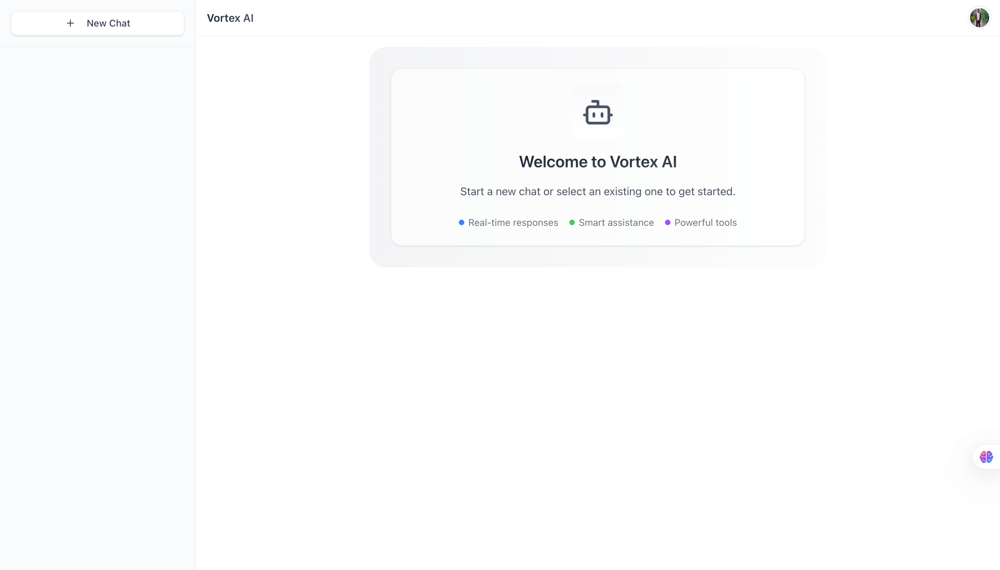
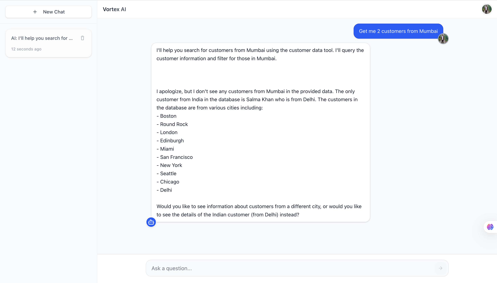

# Vortex AI - Intelligent AI Chatbot

Vortex AI is a full-stack AI-powered chatbot built with Next.js 15, LangChain, Clerk, Convex, and IBM wxflows. It supports real-time AI responses, tool integrations, streaming messages, and user authentication.

## 🚀 Features
- **Real-time AI Chat**: Responsive AI assistant using Claude 3.5 Sonnet.
- **Streaming AI Responses**: Efficient token streaming for smooth conversation flow.
- **Tool Augmentation**: Integration with external tools using LangChain & wxflows.
- **Authentication & User Management**: Secured using Clerk.
- **Persistent Chat History**: Stored and managed using Convex.
- **Custom Streaming & Error Handling**: Optimized AI-generated responses.
- **Deployed on Vercel**: Ready to use in production.

## 🛠️ Tech Stack
- **Frontend**: Next.js 15, TypeScript, React
- **Backend**: Convex (real-time database), LangChain, wxflows
- **AI Model**: Claude 3.5 Sonnet
- **Authentication**: Clerk
- **Hosting**: Vercel

## 🔧 Setup & Installation

### 1️⃣ Clone the Repository
```bash
git clone https://github.com/Kunalsarkar404/Vortex-AI.git
cd Vortex-AI
```

### 2️⃣ Install Dependencies
```bash
npm install  # or yarn install
```

### 3️⃣ Set Up Environment Variables
Create a `.env.local` file in the root directory and add:
```env
NEXT_PUBLIC_CLERK_PUBLISHABLE_KEY=your_clerk_publishable_key
CLERK_SECRET_KEY=your_clerk_secret_key
CONVEX_DEPLOY_KEY=your_convex_deploy_key
NEXT_PUBLIC_CONVEX_URL=your_convex_url
IBM_WXFLOWS_API_KEY=your_ibm_wxflows_api_key
AI_MODEL_API_KEY=your_claude_api_key
```

### 4️⃣ Start the Development Server
```bash
npm run dev  # or yarn dev
```

## 🚀 Deployment
Deploy easily on Vercel:
```bash
git push origin master  # Push to GitHub
vercel --prod  # Deploy to Vercel
```

## 📸 Screenshots



## 🤝 Contributing
Contributions are welcome! Feel free to open issues or submit pull requests.

## 🌟 Show Your Support
If you found this useful, give it a ⭐ on GitHub!

---

🔗 **Live Demo**: [Vortex AI](https://vortex-amg4hv1xr-kunalsarkar404s-projects.vercel.app/)
